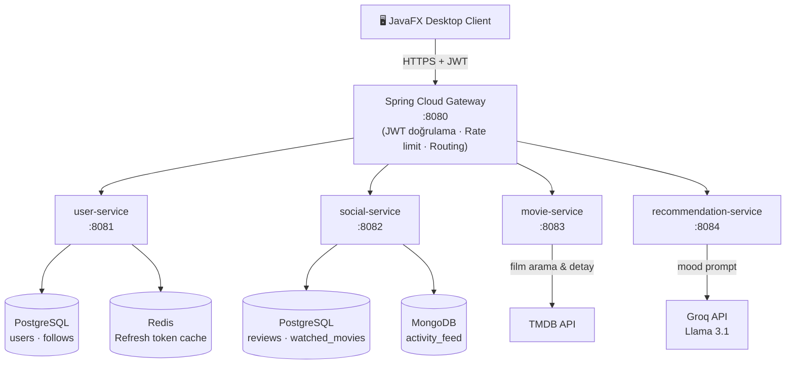

# MoodWatch

> Ruh halinize göre film öneren akıllı platform — Kocaeli Üniversitesi TBL324 İleri Java Uygulamaları Dönem Projesi


---

## Hakkında

MoodWatch, kullanıcının anlık ruh haline göre kişiselleştirilmiş film önerileri sunan bir masaüstü uygulamasıdır. JavaFX tabanlı istemci, Spring Cloud mikroservis mimarisiyle konuşur; film verileri TMDB'den, öneri zekası Groq AI (Llama 3.1) üzerinden sağlanır.

---

## Mimari



### Servisler

| Servis | Port | Görev | Veritabanı |
|---|---|---|---|
| **gateway** | 8080 | JWT doğrulama, rate limit (100 req/dk), routing | — |
| **user-service** | 8081 | Kayıt, giriş, JWT, profil, takip | PostgreSQL + Redis |
| **social-service** | 8082 | Yorum, izleme kaydı, aktivite akışı | PostgreSQL + MongoDB |
| **movie-service** | 8083 | Film arama, detay, TMDB önbellek | TMDB API |
| **recommendation-service** | 8084 | Mood bazlı öneri üretimi | Groq API |

---

## Özellikler

- **Film Arama** — TMDB entegrasyonu ile milyonlarca film arasında anlık arama
- **Mood Bazlı Film Önerisi** — Groq AI (Llama 3.1) ile ruh halinize özel kişisel öneri listesi; minimum puan, süre ve tür filtreleri
- **İzleme Listesi** — Film ekleme ve kaldırma; izlenen filmler takip edilir
- **Film Detay Sayfası** — Oyuncu kadrosu, fragman linki, TMDB puanı ve özet
- **Kullanıcı Kayıt / Giriş** — JWT tabanlı kimlik doğrulama (access 15dk + refresh 7 gün); BCrypt parola güvenliği

---

## Başlarken

### Gereksinimler

- [Docker Desktop](https://www.docker.com/products/docker-desktop/) (tüm altyapıyı ayağa kaldırır)
- Java 23+ (JavaFX istemcisini çalıştırmak için)

### Kurulum

1. **Repoyu klonlayın**

   ```bash
   git clone https://github.com/keremvarlii/moodwatch.git
   cd moodwatch
   ```

2. **Ortam değişkenlerini ayarlayın**

   ```bash
   cp .env.example .env
   ```

   `.env` dosyasını açıp aşağıdaki alanları doldurun:

   ```env
   TMDB_API_KEY=your_tmdb_api_key
   GROQ_API_KEY=your_groq_api_key
   JWT_SECRET=your_jwt_secret_min_32_chars
   ```

3. **Tüm servisleri Docker ile başlatın**

   ```bash
   docker-compose up -d --build
   ```

   İlk başlatmada imajlar indirilir; yaklaşık 2–3 dakika sürebilir.  
   Servis durumunu kontrol etmek için: `docker-compose ps`

4. **JavaFX istemcisini çalıştırın**

   ```powershell
   .\run.ps1
   ```

   Gateway `localhost:8080` üzerinde hazır olduktan sonra giriş yapabilirsiniz.

---

## API Anahtarları

### TMDB API Anahtarı

1. [themoviedb.org](https://www.themoviedb.org/) adresinde ücretsiz hesap açın
2. **Ayarlar → API** bölümünden "API Key (v3 auth)" değerini kopyalayın
3. `.env` dosyasındaki `TMDB_API_KEY` alanına yapıştırın

### Groq API Anahtarı

1. [console.groq.com](https://console.groq.com/) adresinde ücretsiz hesap açın
2. **API Keys → Create API Key** ile yeni bir anahtar oluşturun
3. `.env` dosyasındaki `GROQ_API_KEY` alanına yapıştırın

> API anahtarlarınızı asla `.env` dosyasıyla birlikte Git'e göndermeyin. `.env` dosyası `.gitignore`'a eklenmiştir.

---

## Teknoloji Yığını

**Backend**
- Java 21, Spring Boot 3.3, Spring Cloud Gateway
- Spring Data JPA · Spring Data MongoDB · Spring Data Redis
- Spring Security + JJWT
- Maven, JUnit 5, Mockito, JMeter

**Veritabanları**
- PostgreSQL 16 · MongoDB 7 · Redis 7

**Masaüstü İstemci**
- JavaFX 23, FXML + CSS, Java HttpClient, Jackson

**Dış Servisler**
- TMDB (film verisi) · Groq AI / Llama 3.1 (öneri)

**Altyapı**
- Docker · docker-compose

---

## Ekip

| Kullanıcı | Rol |
|---|---|
| [mustke](https://github.com/mustke) | Backend & Mikroservis Mimarisi |
| [keremvarlii](https://github.com/keremvarlii) | Backend & JavaFX İstemci |

---

*Kocaeli Üniversitesi — Bilişim Sistemleri Mühendisliği — TBL324 İleri Java Uygulamaları*
